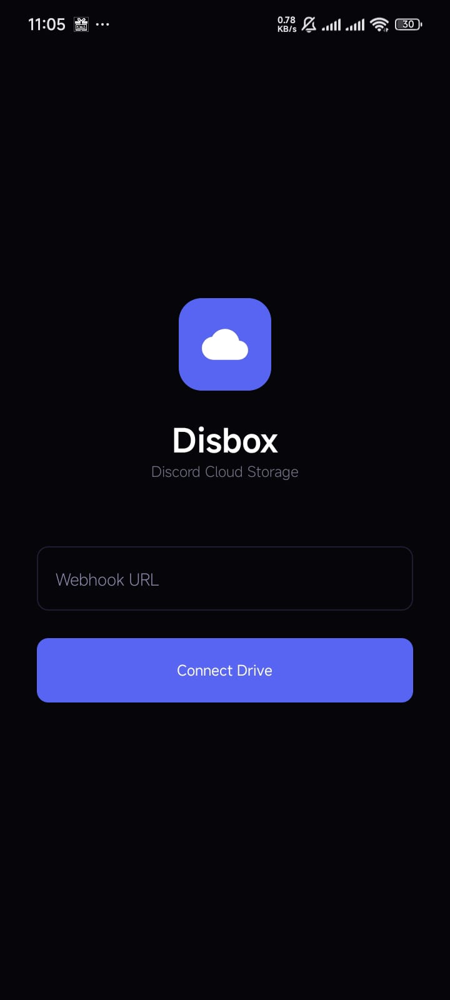

# Disbox Mobile ⬡

Disbox Mobile adalah pendamping seluler untuk ekosistem Disbox, memungkinkan Anda mengelola penyimpanan awan berbasis Discord langsung dari perangkat Android. Dibangun menggunakan **Jetpack Compose** dan **Kotlin**, aplikasi ini menawarkan pengalaman pengelolaan file yang modern, responsif, dan sinkron sepenuhnya dengan versi Desktop.

  
  
  
  
   
  <em>Mobile Preview: Login, File Explorer, Bulk Selection, and Settings</em>

## 🚀 Fitur Utama

*   **Multi-Bahasa (Localization):** [BARU] Mendukung bahasa **Indonesia, English,** dan **Chinese (ZH)**. Bahasa dapat diubah langsung melalui menu pengaturan.
*   **Pengurutan File (Sorting):** [BARU] Urutkan file dan folder berdasarkan **Nama, Tanggal,** atau **Ukuran**. Folder selalu diprioritaskan di atas file.
*   **Validasi Duplikat Lokal:** [BARU] Pengecekan nama file/folder yang sama dilakukan secara instan di database lokal sebelum operasi network, menghemat kuota API Discord dan mencegah konflik data.
*   **Sinkronisasi Metadata v3:** Mendukung struktur `MetadataContainer` terbaru yang identik dengan Desktop, memungkinkan sinkronisasi PIN dan status file secara real-time.
*   **Optimasi Database:** [BARU] Menggunakan mode **Write-Ahead Logging (WAL)** pada database Room untuk performa tulis yang lebih cepat dan UI yang lebih responsif.
*   **Master PIN Cloud Sync:** Atur Master PIN satu kali, dan gunakan di semua perangkat Anda. Hash PIN kini disimpan secara aman di dalam metadata terenkripsi di Discord.
*   **Area Terkunci (Locked Area):** Tab khusus untuk menyimpan file/folder sensitif. Memerlukan verifikasi PIN untuk akses, pengunduhan, atau pemindahan.
*   **Sistem Favorit (Starred):** Tandai file atau folder penting sebagai favorit. Sinkron dengan Desktop menggunakan logika berbasis file `.keep`.
*   **Aksi Massal (Bulk Actions):** Pilih banyak file sekaligus untuk melakukan **Move, Copy, Delete, Star,** atau **Lock** secara bersamaan melalui bilah menu atas.
*   **Unlock & Move:** Fitur khusus untuk membuka kunci item dan langsung memindahkannya ke folder tujuan (termasuk root) dalam satu langkah.
*   **Virtual File System:** Struktur folder yang tertata rapi di database **Room (SQLite)** yang cepat dan efisien.
*   **Rolling Snapshot:** Sistem cadangan otomatis untuk 3 snapshot metadata terbaru guna mencegah kehilangan data.
*   **Mode Tampilan Fleksibel:** Pilih antara mode **Grid** atau **List** dengan slider zoom real-time untuk mengatur ukuran item.
*   **Interface Zoom:** Atur skala antarmuka global melalui halaman pengaturan agar sesuai dengan kenyamanan mata Anda.
*   **Manajemen Tier:** Pilihan ukuran chunk (10MB Free, 25MB Nitro, 500MB Premium) sesuai limit akun Discord.

## 📱 Sinkronisasi Desktop & Mobile

Aplikasi ini dirancang untuk bekerja secara harmonis dengan **Disbox Desktop**. 
*   **Starred items** yang ditandai di HP akan muncul di PC.
*   **Master PIN** yang dibuat di HP akan otomatis terbaca oleh aplikasi Desktop saat Anda login.
*   Perubahan struktur folder di satu perangkat akan terdeteksi oleh perangkat lain dalam hitungan detik.

## 🛠 Prasyarat

*   Android 7.0 (API Level 24) atau lebih baru.
*   Koneksi internet aktif.
*   URL Discord Webhook pribadi.

## ⚙️ Instalasi

1.  Unduh APK terbaru dari folder `release`.
2.  Izinkan instalasi dari sumber tidak dikenal di pengaturan Android.
3.  Buka aplikasi dan tempelkan URL Webhook Anda.

## ⚙️ Next Update
### Major
1.  Video/Audio Streaming Player (In-App)
2.  Auto-Backup Folder Gallery/Documents

## 🤝 Kontribusi

Kami menerima laporan bug dan saran fitur!
1. Fork repositori.
2. Buat branch baru (`git checkout -b fitur-mobile`).
3. Commit perubahan Anda.
4. Push ke branch dan buat Pull Request.

## 📄 Lisensi

Proyek ini dilisensikan di bawah **MIT License**.

---

**Developed by Naufal Gastiadirrijal Fawwaz Alamsyah**
*   GitHub: [naufal-backup](https://github.com/naufal-backup)
*   LinkedIn: [Naufal Alamsyah](https://www.linkedin.com/in/naufal-gastiadirrijal-fawwaz-alamsyah-a34b43363)
*   Email: naufalalamsyah453@gmail.com
